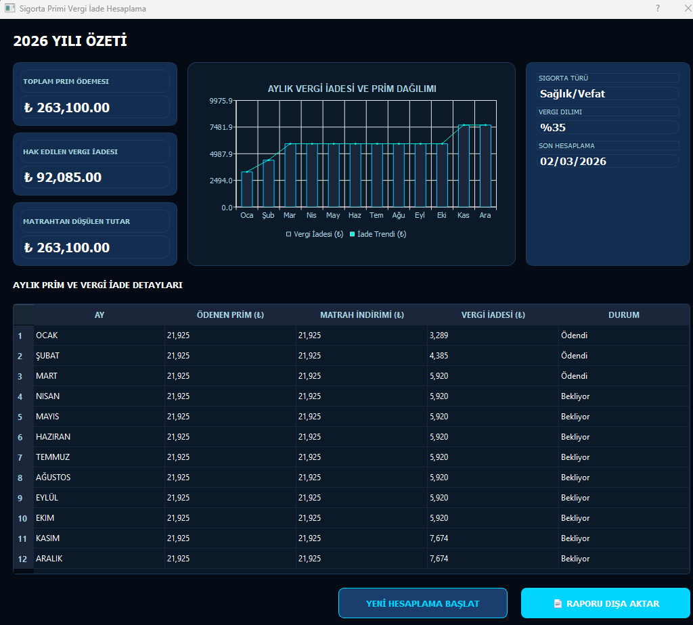

# 🏛️ Finans Asistanı

**Finans Asistanı**, Python ve PyQt5 kullanılarak geliştirilmiş, modern ve kullanıcı dostu bir masaüstü finansal hesaplama aracıdır. Günlük finansal işlemlerini hızlıca halletmek isteyen kullanıcılar için tasarlanmış geniş kapsamlı özelliklere sahiptir.

---

## 🚀 Öne Çıkan Özellikler

### 1. 💱 Kur Dönüşümü
*   **Canlı Veri:** `ExchangeRate API` üzerinden 150+ para birimi için anlık döviz kurları.
*   **Arama ve Seçim:** Geniş para birimi listesi içinde hızlıca seçim yapabilme.
*   **Hızlı Hesaplama:** Birim fiyatı girip saniyeler içinde karşılığını görme.

### 2. 🏛️ Vergi İadesi (Sigorta Prim Avantajı)
*   **Maaş Etkisi:** Hayat ve Şahıs Sigorta primleriniz üzerinden aylık ne kadar vergi iadesi alacağınızı net olarak görün.
*   **Vergi Dilimi Takibi:** Maaşınızın hangi ayda hangi vergi dilimine (%15, %20, %27, %35, %40) geçtiğini otomatik hesaplar.
*   **Poliçe Yönetimi:** Birden fazla poliçeyi (USD veya TRY bazlı) tek bir hesaplamaya ekleme.
*   **Detaylı Rapor:** ASCII tablo formatında şık aylık döküm ve kopyalanabilir sonuç ekranı.

### 3. 📊 Yüzde Hesaplayıcı
*   Değerin %X'i kaçtır?
*   Değerden %X çıkarılırsa sonuç ne olur? (İndirim)
*   Değere %X eklenirse sonuç ne olur? (Artış)
*   Değer, diğer değerin yüzde kaçıdır?
*   Bir değerden diğerine yüzde kaç değişim olmuştur?

---

## 🎨 Tema ve Görsel Deneyim
Uygulama, göz yormayan ve premium hissettiren 5 farklı tema seçeneği ile gelir:
*   **Okyanus (Varsayılan):** Modern lacivert ve turkuaz tonları.
*   **Koyu Mavi:** Derin gece mavisi ve vurgulu renkler.
*   **Sade:** Temiz beyaz ve mavi profesyonel görünüm.
*   **Orman:** Rahatlatıcı yeşil tonları.
*   **Günbatımı:** Turuncu ve morun sıcak uyumu.

---

## 🛠️ Teknik Özellikler
*   **Kaldığın Yerden Devam:** Uygulama, en son kullandığın temayı ve en son hangi sekmede (Kur, Yüzde, Vergi) olduğunu hatırlar.
*   **Hız:** Tüm hesaplamalar yerel kod üzerinde milisaniyeler içinde gerçekleşir.




---

## 📦 Kurulum ve Çalıştırma

### Yöntem 1: Doğrudan .exe (Windows)
`dist/FinansAsistani.exe` dosyasını indirip başka hiçbir kurulum yapmadan doğrudan çalıştırabilirsin.

### Yöntem 2: Python ile (Kaynak Koddan)
1. Python'ın yüklü olduğundan emin ol.
2. Gerekli kütüphaneleri yükle:
   ```bash
   pip install PyQt5 requests PyQtChart
   ```
3. Uygulamayı başlat:
   ```bash
   python calculators.pyw
   ```

### Yöntem 3: Kendin EXE Oluştur
PyInstaller ile tek dosyalık çalıştırılabilir oluşturabilirsin:
```bash
pyinstaller --onefile --noconsole --name "FinansAsistani" calculators.pyw
```

---

## 📜 Lisans
Bu proje geliştirme ve kişisel kullanım amaçlıdır. Verilerin doğruluğu için lütfen resmi finansal kaynakları da kontrol ediniz.

**Geliştirici:** rahman yazgan
